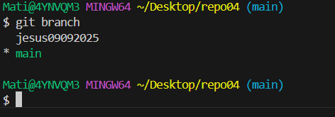

4.1 Crea un directrorio llamado repo04, esta vez tu decides como lo haces. Es decir, tendras que seleccionar uno de los dos caminos que hemos visto en los dos ejercicios anteriores. Pero si que queremos que exista el repostiorio el local y en remoto.  

4.3 crea una rama con tu nombre y la fecha actual (por ejemplo en mi caso la rama se llamara jesus09092025) desde la cual editaremos el fichero
  

4.4 Desde tu rama (jesus09092025) edita el fichero readme.md de tal forma que quede de la saiguiente manera:
  

4.5 Haz 3 commits desde nuestra rama (jesus09092025)
  

4.6 En el siguiente orden realiza lo siguiente:  
4.6.1 Fusiona tu rama con master 
 
4.6.2 Haz un push hacia la nube.